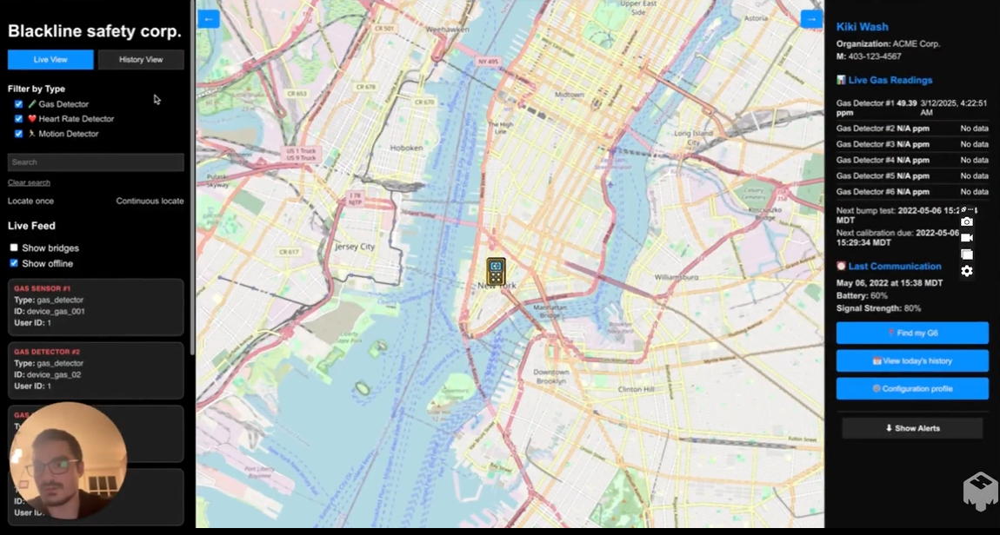

# Edge Safety Hub

Edge Safety Hub is a full-stack real-time worker safety monitoring system that simulates a smart industrial safety environment. It collects data from various sensors (motion, heart rate, gas detectors), processes it through MQTT and Kafka, and displays live updates on a React dashboard.

---

## 🚀 Features

- Real-time sensor data collection and visualization
- Worker-device-user mapping and alerting system
- PostgreSQL for persistent data storage
- Kafka for message brokering
- MQTT for IoT-style sensor communication
- Interactive frontend built in React

---

## 📦 Architecture Overview

This diagram shows the data flow from IoT edge sensors through MQTT, Kafka, and database systems to the frontend dashboard and alerting system.


---

## 🛠️ Technologies Used

- Python (Flask, SQLAlchemy)
- React (Vite, Hooks, Tailwind)
- Kafka, MQTT, Docker
- PostgreSQL
- SQLite (for offline mode)
- Docker Compose

---

## 🧪 Sensor Services

- `gas_detector.py`: Publishes gas levels (`gas_level`) over MQTT
- `motion_sensor.py`: Sends acceleration, location, and fall detection
- `heart_rate_monitor.py`: Emits heart rate and stress levels

All sensors can run in **online** (MQTT) or **offline** (SQLite) mode and sync later.

---

## 🗃️ Data Pipeline

1. Sensors publish to MQTT topics (e.g., `sensor/gas_detector`)
2. `mqtt-to-kafka` container bridges MQTT to Kafka
3. `kafka-consumer` listens to `sensor_data` topic and writes to PostgreSQL
4. Flask `user_service` serves sensor/user data via REST API
5. React dashboard displays data with live updates

---

## 🧑‍💻 Setup Instructions

1. **Clone the repository**
2. **Build and run services**:
   ```bash
   docker-compose build --no-cache
   docker-compose up -d
   ```
3. **Enter PostgreSQL container**:
   ```bash
   docker exec -it postgres_db psql -U postgres -d sensors_db
   ```
4. **Simulate sensor data**:
   ```bash
   python gas_detector.py --online
   python motion_sensor.py --online
   python heart_rate_monitor.py --online
   ```
5. **Frontend**:
   ```bash
   cd frontend
   npm install
   npm run dev
   ```

---

## 📍 Key Endpoints

- `/alerts` – latest alert messages
- `/gas-sensors/latest` – most recent gas readings
- `/users/<user_id>/devices` – devices for a specific user
- `/users/<user_id>/latest-motion` – location tracking via motion sensor
- `/register` & `/register-device` – user and device registration

---

## 📌 Notes

- System simulates real-world sensor network & safety platform
- Easily extendable with more sensor types or logic
- SQLite support allows offline collection with later sync to cloud

---

## 📷 Dashboard Overview

The web interface shows:
- Latest gas levels, location updates, alerts
- Worker profiles and device history
- Unread alert indicator 🔔




---

## ✅ Fully Tested

- Kafka topic ingestion
- PostgreSQL data persistence
- MQTT messaging via Mosquitto
- React dashboard updates
- Simulated test messages

---

## 📬 Contact

For questions, ideas or contributions, feel free to reach out.
